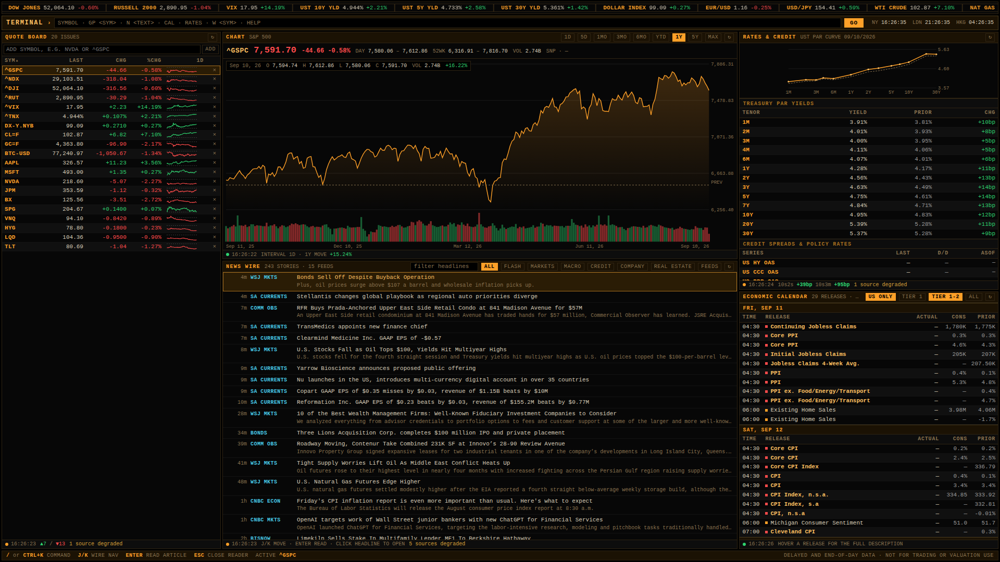
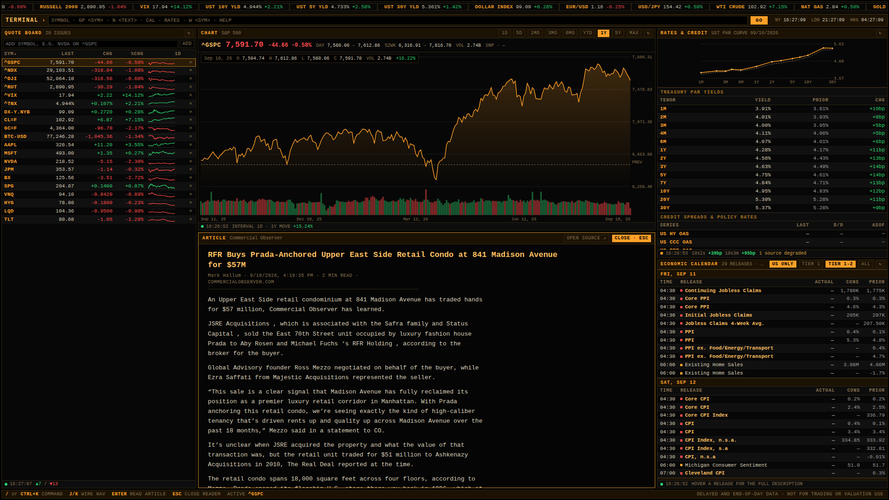

# TERMINAL

A Bloomberg-style market terminal that runs on your own machine: a multi-source
news wire, a quote board of your choosing, interactive charts, a rates and
credit board, an economic calendar, and an in-panel article reader.

Every data source is free and requires no API key, account, or signup.



The article reader, opened over the news wire:



## Running it

Two options. Hosting it needs nothing installed on your machine; running it
locally needs Node.

### Option A: host it (no install, permanent URL)

Deploy to Vercel entirely through the browser. Free tier is sufficient.

1. Go to [vercel.com](https://vercel.com) and sign up with **Continue with
   GitHub**.
2. **Add New → Project**, then import this repository.
3. Set **Root Directory** to `terminal`. This is the one setting that matters:
   the app lives in a subfolder, and the build fails without it.
4. Leave the framework preset (Next.js), build command, and output directory
   at their detected defaults. There are no environment variables to set,
   because no data source needs a key.
5. **Deploy**, wait about two minutes, and open the URL it gives you.

Every push to the branch redeploys automatically. To keep it private, use
Vercel's Deployment Protection setting so only your account can open the URL.

### Option B: run it locally

```bash
cd terminal
npm install
npm run dev
```

Then open http://localhost:3000. Use `npm run build && npm start` for the
faster production build. Requires Node 20 or newer (developed on Node 22).

## Layout

| Panel | Position | Contents |
| --- | --- | --- |
| Tape | Top strip | Scrolling indices, rates, FX, commodities, crypto. Click any item to chart it. Hover to pause. |
| Quote board | Left | Your watchlist: last, change, % change, and an intraday sparkline. Sortable columns, add/remove symbols, persisted locally. |
| Chart | Centre top | Line and volume chart with crosshair readout, previous-close reference, and ranges from 1D to max. |
| News wire | Centre bottom | Merged, de-duplicated headlines from every enabled feed, filterable by category, source, and free text. |
| Rates and credit | Right top | Treasury par curve versus prior session, full tenor table with basis-point moves, credit spreads and policy rates, rate futures. |
| Economic calendar | Right bottom | Releases with actual, consensus, and prior, tiered by market relevance, times in Eastern. |
| Article reader | Overlay | Extracted article text in-panel, opened from any headline. |

## Keyboard

| Key | Action |
| --- | --- |
| `/` or `Ctrl+K` | Focus the command line |
| `J` / `K` or arrows | Move down/up the news wire |
| `Enter` | Open the highlighted headline in the reader |
| `Esc` | Close the reader |

## Command line

Type a bare ticker and press `GO` to chart it, the way `<SYM> <GO>` behaves on
a real terminal. Mnemonics:

| Command | Effect |
| --- | --- |
| `AAPL` | Chart the symbol and add it to the board |
| `GP <SYM>` | Chart the symbol without adding it |
| `W <SYM>` | Add a symbol to the quote board |
| `DEL <SYM>` | Remove a symbol |
| `N <TEXT>` | Filter the news wire; `N` alone clears it |
| `RESET` | Restore the default watchlist and feeds |
| `HELP` | List the commands |

Symbols follow Yahoo Finance conventions: `^GSPC` for the S&P 500, `CL=F` for
WTI futures, `EURUSD=X` for FX crosses, `BTC-USD` for crypto.

## Data sources

| Panel | Source | Notes |
| --- | --- | --- |
| Quotes, charts, futures | Yahoo Finance chart and spark endpoints | Delayed, typically 15 minutes on equities |
| Treasury curve | US Treasury daily par yield curve CSV | Published each afternoon |
| Credit spreads, policy rates | FRED graph CSV (ICE BofA OAS indices, SOFR, EFFR, mortgage rate) | Settles with a one to two day lag |
| Economic calendar | Nasdaq economic events API | Actual, consensus, and prior |
| News | 25 RSS feeds: WSJ, FT, CNBC, MarketWatch, Yahoo Finance, Seeking Alpha, NYT, Economist, Federal Reserve, ECB, SEC, Investing.com, Commercial Observer, Bisnow, HousingWire, Nareit | Toggle any of them under `FEEDS` |

None of these are contractual feeds. They are unauthenticated public
endpoints, so they rate-limit, move, and occasionally return nothing. The app
is built around that: every panel keeps its last good payload on screen, marks
itself degraded in the footer rather than blanking, and names the failing
source on hover.

**This is delayed and end-of-day data. Do not use it for trading or
valuation.**

## Architecture

```
app/
  page.tsx              entry, renders the terminal shell
  globals.css           the entire amber-on-black theme
  api/
    quote/              batched prices + throttled descriptive metadata
    chart/              OHLCV history for one symbol and range
    news/               RSS/Atom/RDF aggregation, de-duplication
    rates/              Treasury curve, FRED series, rate futures
    calendar/           economic releases, several days at a time
    article/            server-side readability extraction
components/
  Terminal.tsx          layout, command line, keyboard, persisted state
  QuoteContext.tsx      one shared price poll for every panel
  Panel.tsx             chrome: title, toolbar, health dot, footer
  PriceChart.tsx        hand-rolled SVG chart with crosshair
  ...                   one component per panel
lib/
  sources.ts            feed registry, default watchlist, tape, aliases
  http.ts               UA, timeouts, 429/5xx retry, concurrency pool
  cache.ts              TTL cache with stale-on-error fallback
  useFeed.ts            polling hook, pauses on a hidden tab
  format.ts             price/percent/bps/volume formatting
```

Three deliberate choices worth knowing about:

**One price poll, not six.** The tape, quote board, and chart header all want
overlapping symbols. They read from a single `QuoteProvider` that issues one
batched request, chunked at the upstream's hard limit of 20 symbols per call.

**Prices refresh fast, descriptions slowly.** Last price and the sparkline come
from a batch endpoint every 15 seconds. Names, day ranges, 52-week ranges, and
volume need one request per symbol, so they are cached for ten minutes and only
a dozen are refreshed per cycle, with the charted symbol first in the queue.
This keeps a 35-symbol board well under the rate limit.

**Cached at the edge, not just in memory.** `lib/cache.ts` holds a TTL map that
serves a single local process well, but on a serverless host each request can
land on a cold instance with an empty map, which would hammer the keyless
upstreams into a rate limit. Every API response therefore carries `s-maxage`
and `stale-while-revalidate` (`lib/apiResponse.ts`), so one upstream fetch fans
out to every viewer and every open tab, and a slow source never blocks a panel.
Error responses are deliberately left uncached.

**Failures are visible, never silent.** Each panel footer carries a health dot
and the time of its last successful load. A blocked publisher, a rate-limited
quote endpoint, or an unreachable FRED shows up as a degraded count you can
hover for detail, while the rest of the screen keeps working.

## Configuration

Defaults live in `lib/sources.ts`: `DEFAULT_WATCHLIST`, `TAPE_SYMBOLS`,
`NEWS_SOURCES` (with `enabledByDefault` per feed), and `SYMBOL_ALIASES` for
display names. Your watchlist, enabled feeds, active symbol, and chart range
are saved to `localStorage`, so edits in the UI survive a reload; `RESET`
restores the defaults.

FRED series shown on the rates board are listed in `app/api/rates/route.ts`
under `FRED_SERIES`. Any FRED series ID works, so adding a line is one entry.

### Behind a proxy

`npm run dev` and `npm start` go through `scripts/run.mjs`, which sets
`NODE_USE_ENV_PROXY=1` so server-side fetches honour `HTTPS_PROXY` and
`NO_PROXY`. Node's built-in fetch ignores those variables by default, which
breaks every feed on a corporate network. Set `NODE_USE_ENV_PROXY=0` to opt
out.

## Known limits

- Paywalled and bot-walled publishers (WSJ, FT, Seeking Alpha) return their
  headline and summary but no article body. The reader says so and offers an
  OPEN SOURCE link, where your own browser session applies.
- The economic calendar occasionally repeats one day's schedule onto the next
  and omits some forward-dated consensus figures. Repeated days are dropped and
  actuals are never shown for a future date, but confirm anything that matters
  against the issuing agency.
- Credit spreads are FRED end-of-day, not live. There is no free live source
  for CDX, CMBS, or loan spreads; those need a paid feed.
- Quotes are delayed. Yahoo's endpoints are unofficial and can change without
  notice.
